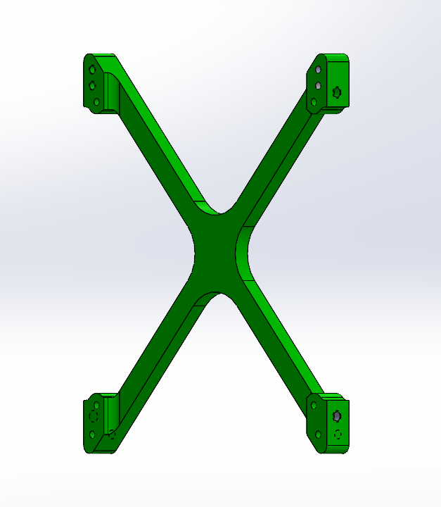

# ME405 Lab 2: Control Freaks

## Closed Loop Controller Layout
We are using a simple closed loop feedback system that connects a single proportional controller to a motor driver that turns our motor. 
Using the encoder position readings, we are able to send an error signal back to the motor driver. When a step input is supplied and the output
position does not match the desired setpoint, the error signal value is reported as *actual encoder position - desired encoder position*.

The error signal is looped back into the proportional controller that modifies the motor duty cycle. If there is a larger % overshoot, the motor
will try to correct itself by setting a higher duty cycle to correct erro quickly. When the system has reached the setpoint, ideal it will stop oscillating,
but with a proportional only controller, there will be steady state error at the end of the step response. The motor will constantly try to correct it, but 
it is only possible if we add in an integral controller to eliminate the SSE. 

Our code accomplishes this feedback loop by using a proportional controller class that collects position and time data and stores it as a tuple. Then we have 
a function that prints all the data as a string. This printed list of data is later used by the Python script running on our PC to plot the response that is
produced by the main code running on the microcontroller. 

## Step Response Plots
